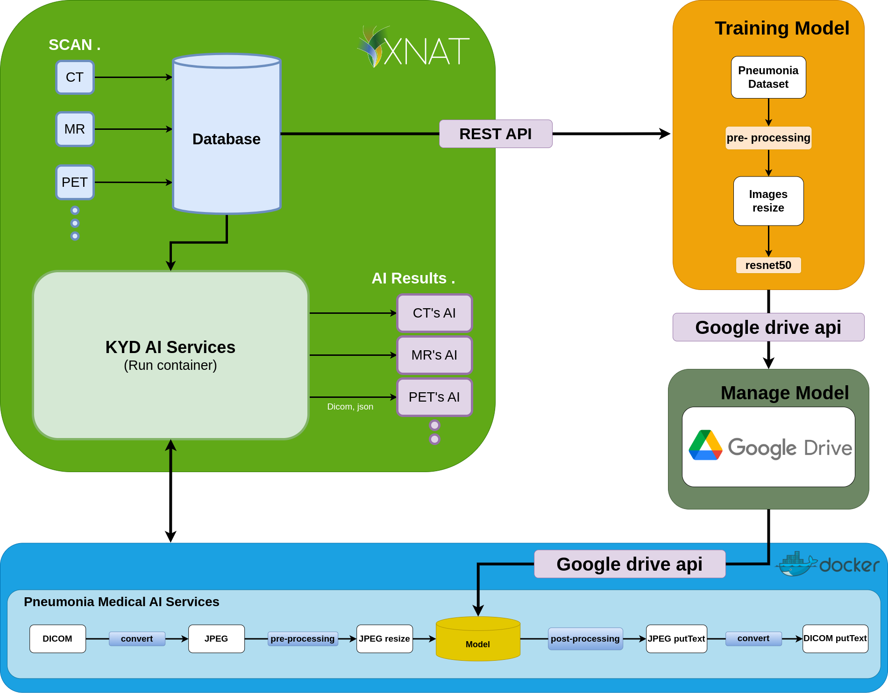

# AI Service On VXNAT Project
## Diagram

Applications are divided into 3 parts according to folders

1. Class_label --> It is a plugin for labeling on VXNAT.
2. Dowloadandtraining --> To download images from VXNAT for training on my local machine via a REST API and upload the trained model to Google Drive using the Google Drive API.
3. ai_service --> Download the model from Google Drive using the Google Drive API and utilize the model to predict medical images of patients with pneumonia.

Prior to using the program, users should install xnat-docker-compose and run it to activate the xnat-server. For additional information, please refer to https://github.com/NrgXnat/xnat-docker-compose.