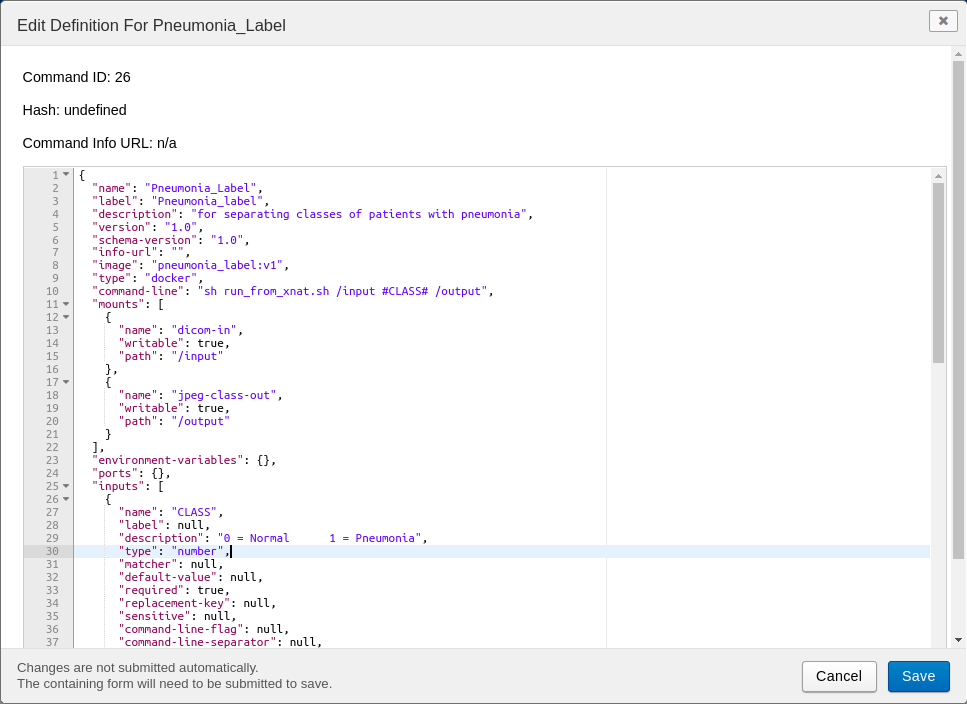
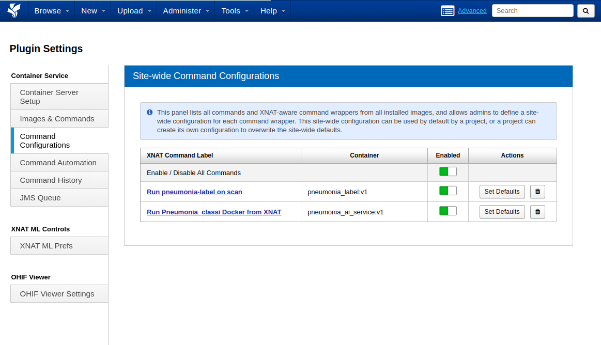
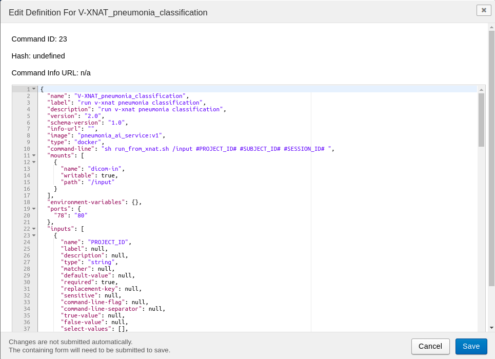
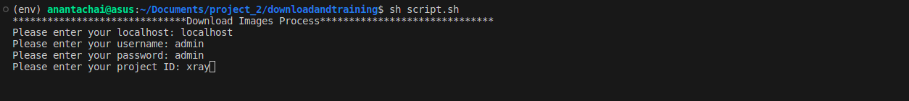

# AI Service On VXNAT Project
[TH] : โปรแกรมพยากรณ์ภาพถ่ายเอกซเรย์ปอดสำหรับผู้ป่วยโรคปอดอักเสบบนแพลตฟอร์ม VXNAT

[ENG] : VXNAT-based pulmonary x-ray prediction program for pneumonia patients.
## Project Description 
This project develops a class separation program and a model learning program to utilize the models as AI services on the VXNAT platform.

โครงงานนี้พัฒนาโปรแกรมการแยกคลาส และโปรแกรมการเรียนรู้โมเดล เพื่อนำโมเดลไปใช้งานในรูปแบบของ AI Serviec บน VXNAT แพลตฟอร์ม 

# Diagram


## กระบวนการทำงาน
จะถูกแบ่งออกเป็น 3 ส่วน 

1. ส่วนของ plugin สำหรับการแยกคลาส (Class_label) เป็น plugin ที่ทำงานบน VXNAT แพลตฟอร์มสำหรับทำการแยกคลาสภาพถ่ายเอกซเรย์ทรวงอกของผู้ป่วย โดยจะมี 2 คลาส ได้แก่ nomal และ pneumonia

2. เมื่อทำการแยกคลาสด้วย (Class_label) เรียบร้อย จะใช้โปรแกรมสำหรับการเรียนรู้โมเดล (Downloadandtraining) ทำการรันบนเครื่องคอมพิวเตอร์ โปรแกรมจะใช้ REST API ในการเชื่อมต่อกับ VXNAT แพลตฟอร์ม และทำการดาวน์โหลดภาพที่ได้ทำการแยกคลาสไว้แล้วมาจัดเก็บไว้บนคอมพิวเตอร์ จากนั้นจะทำการจัดเตรียม Dataset และทำการ Training ด้วย VGG16 โมเดล เสร็จสินกระบวนการ Training โปรแกรมจะทำการอัปโหลดไฟล์โมเดลขึ้นไปเก็บไว้บน Google Drive โดยอัตโนมัติ

3. ส่วนของ AI Service Plugin จะทำงานบน VXNAT แพลตฟอร์ม เมื่อเรื่มใช้งาน plugin จะทำการดาวน์โหลดไฟล์โมเดลจาก Google Drive และนำไปทำนายผลภาพถ่ายเอกซเรย์ทรวงอกของผู้ป่วยว่ามีโอกาสเป็นโรคปอดอักเสบหหรือไม่ 

# Skills
Essential skills for project development.
- Python
- Docker
- Tensorflow
- JSON

# Documentation

Dropbox --> https://www.dropbox.com/scl/fi/9ouigkz82pr8qbqlmyj7b/VXNAT-based-pulmonary-x-ray-prediction-program-for-pneumonia-patients..paper?rlkey=jskxxcz90q6pi9mz1bwvdw6q8&dl=0

# Component
You must have these installed first.

## Software
- Ubuntu 20.04.5 LTS
- Python 3.8.10
- Docker 24.0.2
- Tensorflow 2.12.0
- xnat-docker-compose Instsllation method ---> [Link](https://github.com/NrgXnat/xnat-docker-compose/tree/features/dependency-mgmt)

## Dev Tool
- VScode or Visual Studio Code version 1.67.0

# Installation


Prior to using the program, users should install xnat-docker-compose and run it to activate the xnat-server. For additional information, please refer to [Link](https://github.com/NrgXnat/xnat-docker-compose/tree/features/dependency-mgmt)


Generate a token for connecting to Google Drive. ---> [Link](https://developers.google.com/drive/api/guides/about-sdk)

## Step : 1 Install AI Service On VXNAT Project
Please clone this repository from anantachai352/ai-service-on-xnat-project on Github
```bash
$ git clone https://github.com/anantachai352/ai-service-on-xnat-project.git
```

## Step : 2 Create Pneumonia Label Plugin
1. After completing the repository clone, use the following command to navigate into the folder Class_label

```bash
$ cd /ai-service-on-xnat-project/Class_label
```

2. Build docker image

```bash
$ docker build -t class_label .
```

3. Copy the code from the ***command.json*** file and paste it into the JSON file on VXNAT to establish communication between VXNAT and the Docker image.



4. Plugin Enabled




## Step : 3 Create AI Service Plugin

The user must have a Google account and enable the Google Drive API to obtain a token for connecting to Google Drive. The token will be in the form of a ***JSON*** file that the user needs to download and add to the program's working directory. For more information, please refer to [Link](https://developers.google.com/drive/api/guides/about-sdk)

1. After completing the repository clone, use the following command to navigate into the folder ai_service

```bash
$ cd /ai-service-on-xnat-project/ai_service
```
2. Navigate to ***downloadFile.py*** to modify the code in the ***CLIENT_SECRET_FILE*** and ***folder_id*** sections.

3. Build docker image

```bash
$ docker build -t pneumonia_ai_service .
```

4. Copy the code from the ***command.json*** file and paste it into the JSON file on VXNAT to establish communication between VXNAT and the Docker image.



5. Plugin Enabled


## Step : 4 Set Training Program

1. Prior to using the program, users should install xnat-docker-compose and run it to activate the xnat-server. For additional information, please refer to [Link](https://github.com/NrgXnat/xnat-docker-compose/tree/features/dependency-mgmt)


2. The user needs to know the ***URL*** of the VXNAT server, as well as the ***username*** and ***password*** for logging in and accessing the system.


3. The user must have a Google account and enable the Google Drive API to obtain a token for connecting to Google Drive. The token will be in the form of a ***JSON*** file that the user needs to download and add to the program's working directory. For more information, please refer to [Link](https://developers.google.com/drive/api/guides/about-sdk)

4. Navigate to the 'Downloadandtraining' folder.

```bash
$ cd /ai-service-on-xnat-project/Downloadandtraining
```
5. Create environment
```bash
$ python3 -m venv env 
```
6. Install environment 
```bash
$ pip install -r req.txt
```

# Running Tests
To run tests, Run the following command
```bash
$ sh script.sh
```
When running the sh ***script.sh*** successfully, the user will be prompted to enter the **URL**, **User**, **Password**, and **Project ID**.



# Support & Feedback
If there is a problem and need help or If you have any feedback, you can contact us at

Send email to anantachaikwanwongtim@gmail.com

# Used By
This project has been developed by :

62050303 Anantachai Kwanwongtim (Student), Faculty of Engineering, Burapha University, Department of Embedded Systems.

